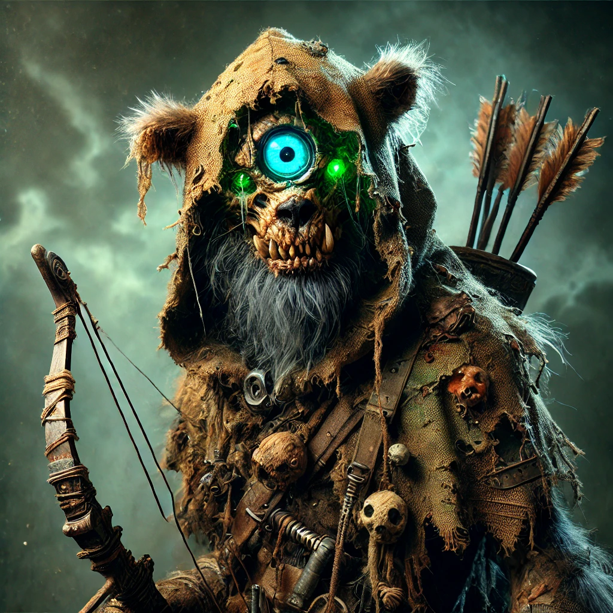

# Summary
## Locations Discovered: 
- A Ruined Horse Drawn Carriage
- Submerged Battleship Wreck.
- Ruined Lightning Rail Station, Interior.

## Encounters:
- One Zombie
- One Murder Storm
- Three Mournland Mutated Gnolls 

## Defeated Foes: 
- One Zombie. 
- Three Mournland Mutated Gnolls 

## Quests Completed:
- A Sample of Water for an Aspiring Alchemist.
- A Foothold into the Past

## Gold: 
- 700gp

## Treasure: 
- One Horning of Summoning.
- Healing Potions now for Sale from Troxler.
- One Ring of Revivify
- One Makeshift Gnoll Crossbow, two infusion slots, one fire infusion slot.
- One Makeshift Gnoll Crossbow, one infusion slot, empty.

## New NPCs: 
- Farlight Family 
- Darren the Zombie (dead, again). 

# Session Recap - Part One

The session started with the party in the town of [[Salvation]] following an attack by a corrupted demi-god. The invading army from [[House Thanuui]] was defeated, and the beast was resurrected and saved from being fed to the warlock's patron, thanks to the magical power of the shopkeeper [[Silas]]. The creature, a two-headed bird called an [[Aliphox]], healed the party, gifted them a horn of summoning (which has yet to be tested), and inspired the warlock [[Gyda]] to open up about her past. Gyda was born into a lawful evil cult that practices human sacrifice and works with a patron that devours souls. She was sent to assassinate a paladin, who spared her life and gave her a chance to change her ways, which she is now embracing. The party, after some testing questions, has renewed trust in Gyda, and the paladin has sworn to help free other members trapped in the cult. Afterward, the party met the [[Farlight Family]], who recently arrived in town and are helping to rebuild after the battle. As thanks for the party's actions, the Farlights will upgrade the party's shack to something more deserving of local folk heroes.

## Session Recap - Part Two
The party restocked and resupplied in [[Salvation]], then headed to [[Stillwater Lake]] to recover a sample of contaminated water for [[Troxler]]. The party encountered a zombie that led them to a long-abandoned horse-drawn carriage, full of people killed on the Day of Mourning, seemingly by internal magical injuries to their lungs. Reaching the lake, the party found a sunken Cyran battleship, its zombified crew shackled to the wreck. [[Ramar]] and [[Cassie]] considered freeing the zombies but decided against it, as the zombies seemed judgmental about their lack of military uniforms. The party recovered the water sample and recruited a friendly group of [[flumphs]], who seemed to have memories of the land before the Mourning. They returned to town, where Troxler had figured out how to create basic potions that would work in the Mournlands. [[Talon]] learned from Troxler that she was studying a contaminated mineral called [[Croydonite]], a starry substance that could temporarily stun and disorient anyone that examines it too closely. Her research indicated that it contained an abnormally high quantity of radiant energy. The party then headed out to the wasteland, finding that it was dawn there despite being afternoon in town. They sought the ruins of the [[Royal Library]] in the mountains to the north, but first, they had to find their way through the ruins of the [[lightning rail station]]. A storm containing a murderous spirit overwhelmed the party, but they reached the station, where they found imprisoned zombies, no corpses, and a crude tripwire trap. They discovered the tunnel through the mountains that should lead them to the library ruins but were ambushed by three-eyed psychic gnolls mutated by exposure to the Mournlands. A tense battle ensued, where Cass and Talon were nearly killed, but the party was ultimately victorious, with one of the ambush party fleeing using invisibility. The gnolls withdrew, only wanting to engage where they had an overwhelming advantage against their foes. The party recovered two magically infused crossbows and a ring of revivify and can now use the [[rail station ruins]] as a base of operations for exploring the wasteland.

